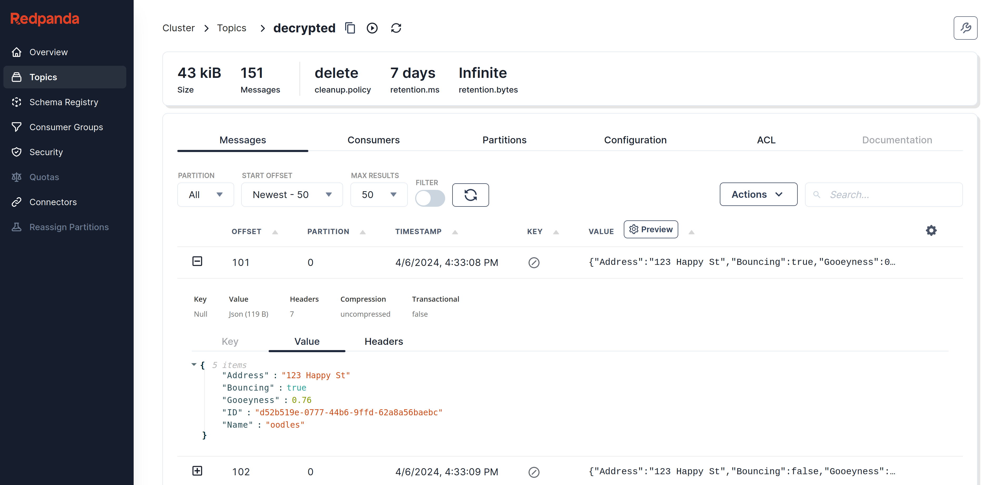

This is a custom processor that takes a list of JSON paths to specific fields in a message along with a key string. The value of each path is then decrypted using the AES encryption standard.

The input is a Kafka topic on Redpanda, so this repo includes details for starting up Redpanda and Redpanda Console.

## Overview

Given the following input, which is a topic containing data with encrypted data in the `Name` and `Address` fields:

```
input:
  kafka:
    addresses: [ localhost:9092 ]
    consumer_group: benthos-redpanda
    topics: [ encrypted ]
```

The following decrypt pipeline will encrypt the `Name` and `Address` properties:

```
pipeline:
  processors:
    - decrypt:
        fields: [ Name, Address ]
        keyString: 532468f222e3394d3363ca4bbc19235a2590ae38a456e573038ea0b508b2d467
```

A complete configuration example can be found [here](./config.yaml).

## Prerequisites

The config in this repo reads data, decrypts the encrypted portion of the data, and then writes it to a topic in Redpanda. The encrypt repo [here](https://github.com/vuldin/benthos-encrypt) provides instructions for deploying Redpanda along with generating the encrypted data.

Golang 1.21.5 was used while creating this repo, but other versions will work. One way to get Golang installed (if you don't already have it) is [gvm](https://github.com/moovweb/gvm). Once installed, use `gvm` to install Golang 1.21.5:

```sh
bash < <(curl -s -S -L https://raw.githubusercontent.com/moovweb/gvm/master/binscripts/gvm-installer)
gvm install go1.21.5
```

> Note: If you use zsh, replace `bash` with `zsh` in the command above.

Now you can switch to this Golang version at any time:

```
gvm use 1.21.5
```

## Usage

First follow [these](https://github.com/vuldin/benthos-encrypt/blob/main/README.md) instructions to:
- create data
- encrypt the `Name` and `Address` fields
- write that data to a Redpanda topic.

Copy and paste the value of `keyString` used while running the above instructions into `config.yaml` as the new `keyString` value within the decrypt processor.

Now start Benthos:

```sh
go run main.go -c config.yaml
```

Data is now being read from the `encrypted` topic. The decrypt processor decrypts the `Name` and `Address` fields. Finally the data is then written to Redpanda in the topic `decrypted`.

Open [Redpanda Console](http://localhost:8080/topics/decrypted?p=-1&s=50&o=-1#messages) to view the message, ensuring the fields `Name` and `Address` are decrypted:



## Cleanup

Follow the instructions [here](https://github.com/vuldin/benthos-encrypt/blob/main/README.md#cleanup).

